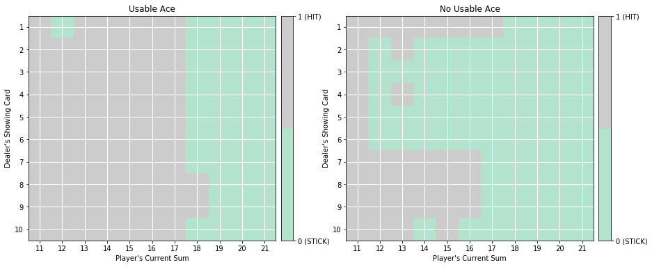

# MonteCarloMethods
A python implementation of many Monte Carlo (MC) algorithms.

## Background

>  
 Simple blackjack environment
    Blackjack is a card game where the goal is to obtain cards that sum to as
    near as possible to 21 without going over.  They're playing against a fixed
    dealer.
    Face cards (Jack, Queen, King) have point value 10.
    Aces can either count as 11 or 1, and it's called 'usable' at 11.
    This game is placed with an infinite deck (or with replacement).
    The game starts with dealer having one face up and one face down card, while
    player having two face up cards. (Virtually for all Blackjack games today).
    The player can request additional cards (hit=1) until they decide to stop
    (stick=0) or exceed 21 (bust).
    After the player sticks, the dealer reveals their facedown card, and draws
    until their sum is 17 or greater.  If the dealer goes bust the player wins.
    If neither player nor dealer busts, the outcome (win, lose, draw) is
    decided by whose sum is closer to 21.  The reward for winning is +1,
    drawing is 0, and losing is -1.
    The observation of a 3-tuple of: the players current sum,
    the dealer's one showing card (1-10 where 1 is ace),
    and whether or not the player holds a usable ace (0 or 1).
    This environment corresponds to the version of the blackjack problem
    described in Example 5.1 in Reinforcement Learning: An Introduction
    by Sutton and Barto.
    http://incompleteideas.net/book/the-book-2nd.html

## Implementation 
1. MC Prediction (for estimating the action-value function)
    - arguments  
        - env: This is an instance of an OpenAI Gym environment.
        - num_episodes: This is the number of episodes that are generated through agent-environment interaction.
        - generate_episode: This is a function that returns an episode of interaction.
        - gamma: This is the discount rate. It must be a value between 0 and 1, inclusive (default value: 1).
    - The algorithm returns as output:
        - Q: This is a dictionary (of one-dimensional arrays) where Q[s][a] is the estimated action value corresponding to state s and action a.
2. constant- alpha MC control
    - arguments
        - env: This is an instance of an OpenAI Gym environment.
        - num_episodes: This is the number of episodes that are generated through agent-environment interaction.
        - alpha: This is the step-size parameter for the update step.
        - gamma: This is the discount rate. It must be a value between 0 and 1, inclusive (default value: 1).
    - The algorithm returns as output:
        - Q: This is a dictionary (of one-dimensional arrays) where Q[s][a] is the estimated action value corresponding to state s and action a.
        - policy: This is a dictionary where policy[s] returns the action that the agent chooses after observing state s.

## Result 
|Usable Ace action-value function | No usable Ace action-value function|
|--|--|
| |  |

poltted optimal policy

## Reference 
- [OpenAI Gym: BlackJack Env] https://github.com/openai/gym/blob/master/gym/envs/toy_text/blackjack.py

